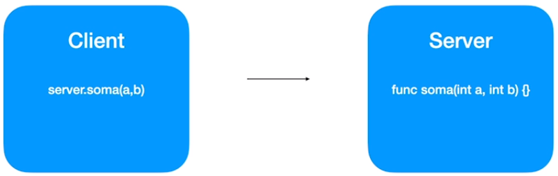
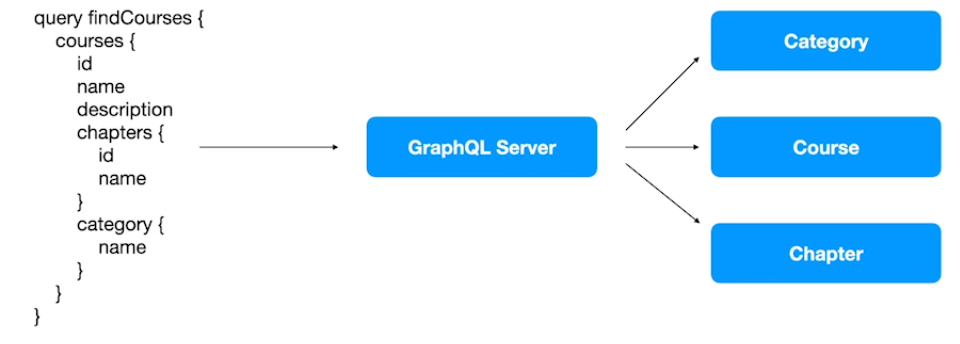
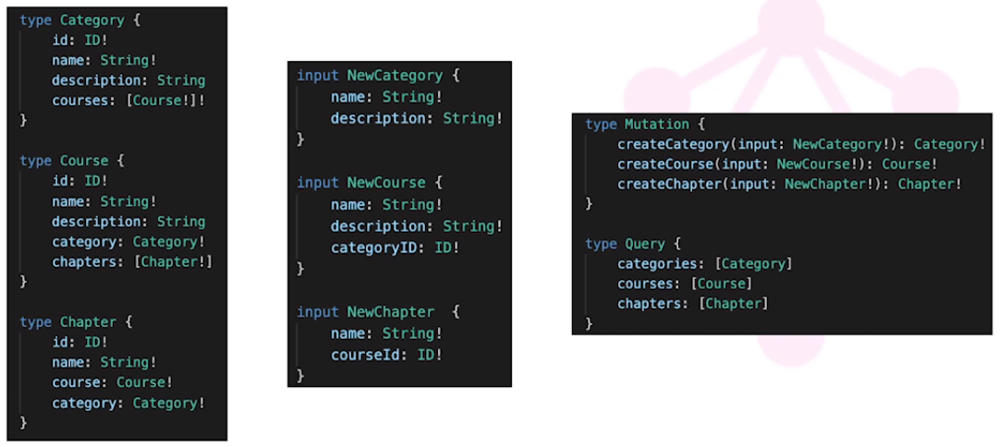
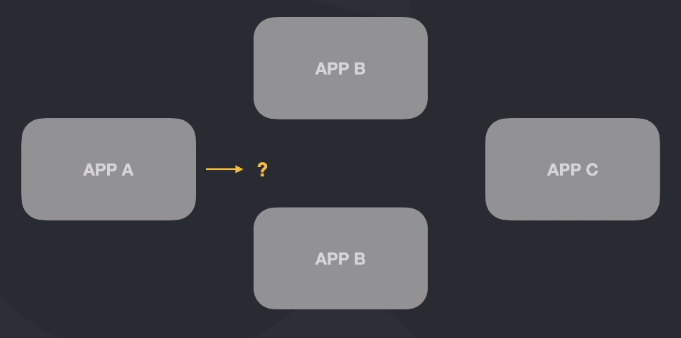
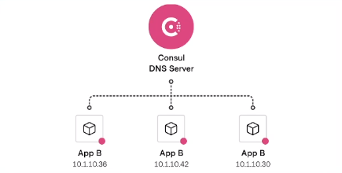
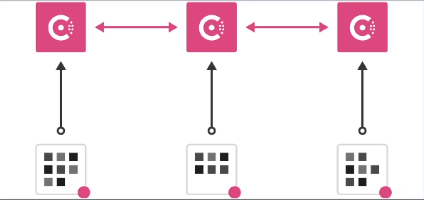
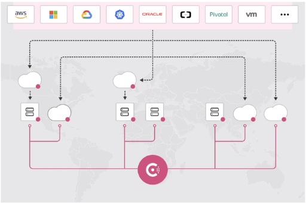

# Comunicação

- **Comunicação sincrona**: Acontece em tempo real. Alta dependencia entre sistemas.
- **Comunicação assincrona**: Não precisa ter a resposta na hora. Dependencia fraca entre sistemas.

## Comunicação Sincrona vs Assincrona

## REST
- Muitos desenvolvedores "já sabem trabalhar com REST"
- Representational state of transfer
- Surgiu em 2000 por Roy Fielding em uma dissertação de doutorado
- Simplicidade
- Stateless
- Cacheável

## REST: Níveis de maturidade (Richardson Maturity Model)

**Nivel 0:** The Swamp of POX

**Nível 1:** Utilização de resources

| Verbo  | URI         | Operação |
| ------ | ----------- | -------- |
| GET    | /products/1 | Buscar   |
| POST   | /products   | Inserir  |
| PUT    | /products/1 | Alterar  |
| DELETE | /products/1 | Remover  |

**Nível 2:** Utilização de Verbos HTTP mediante a sua representatividade

| Verbo  | Utilização           |
| ------ | -------------------- |
| GET    | Recuperar informação |
| POST   | Inserir              |
| PUT    | Alterar              |
| DELETE | Remover              |

**Nível 3:** HATEOAS: Hypermedia as the Engine of Application State

``` json
HTTP/1.1 200 OK
Content-Type: application/vnd.acme.account+json
Content-Length: ...

{
    "account": {
        "account_number": 12345,
        "balance": {
            "currency": "usd",
            "value": 100.00
        },
        "links": {
            "deposit": "/account/12345/deposit",
            "withdraw": "/account/12345/withdraw",
            "transfer": "/account/12345/transfer",
            "close": "/account/12345/close"
        }
    }
}
```

## REST: Uma boa API REST

- Utiliza URIs únicas para serviços e itens que expostos para esses serviços
- Utiliza todos os verbos HTTP para realizar as operações em seus recursos, incluindo caching
- Provê links relacionais para os recursos exemplificando o que pode ser feito

## REST: HAL, Collection+JSON e Siren

- JSON não provê um padrão de hipermídia para realizar a linkagem
- HAL: Hypermedia Application Language
- Siren

## REST: HAL
Media Type = application/hal+json
```json
{
    "_links":{
        "self":{
            "href":"http://fullcycle.com.br/api/user/robson"
        }
    },
    "id":"robson",
    "name":"Robson Silva",
    "_embedded":{
        "family":{
            "_links":{
                "self":{
                    "href":"http://fullcycle.com.br/api/user/aline"
                }
            },
            "id":"aline",
            "name":"Aline França"
        }
    }
}
```

## REST: HTTP Method Negotiation
HTTP possui um outro método: OPTIONS. Esse método nos permite informar quais métodos são permitidos ou não em determinado recurso.

**OPTIONS /api/product HTTP/1.1**
**Host: fullcycle.com.br**

Resposta pode ser:
**HTTP/1.1 200 OK**
**Allow: GET, POST**

Caso envie a requisição em outro formato:
**HTTP/1.1 405 Not Allowed**
**Allow: GET, POST**

## REST: Content Negetiation
O Processo de content negotiation é baseado na requisição que o client está fazendo para server. Nesse caso ele solicita o que e como ele quer a resposta. O server então retornará ou não a informação no formato desejado.

**Accept Negotiation**
- Client solicita a informação e o tipo de retorno pelo server baseado no media type informado por ordem de prioridade.

**GET /product**
**Accept: application/json**

Resposta pode ser retorno dos dados ou:
**HTTP/1.1 406 Not Acceptable**

**Contenty-Type Negotiation**
Através de um content-type no header da request, o servidor consegue verificar se ele irá conseguir processar a informação para retornar a informação desejada.
``` json
POST /product HTTP/1.1
Accept: application/json
Content-Type: application/json

{
    "name":"Product 1"
}
```

Caso o servidor não aceite o content type, ele poderá retornar:
``` json
HTTP/1.1 415 Unsupported Mediaw Type
```

## gRPC
- É um framework desenvolvido pela google que tem o objetivo de facilitar o processo de comunicação entre sistemas de uma forma extremamente rápida, leve, independente de limguagem.
- Faz parte da CNCF (Cloud Native Computation Foundation)

##### Em quais casos podemos utilizar?
- Ideal para microsserviços
- Mobile, Browser e Backend
- Geração das bibliotecas de forma automática
- Streaming didirecional utilizando HTTP/2
  
##### Linguagens (Suporte oficial)
- GO
- JAVA
- C
    - C++
    - Python
    - Ruby
    - Objective C
    - PHP
    - C#
    - NodeJS
    - Dart
    - Kotlin/JVM

##### RPC - Remote Procedure Call


##### Protocol Buffers
"Protocol buffers are Google's language-neutral, extensible mechanism for serializing structured data - think XML, but smaller, faster, and simplier."

##### Protocol vs JSON
- Arquivos binários < JSON
- Processo de serialização é mais leve (CPU) do que JSON
- Gasta menos recursos de rede
- Processo é mais veloz

Protocol Buffers
``` bash
syntax = "proto3";

message SearchRequest {
    string query = 1;
    int32 page_number = 2;
    int32 result_per_page = 3;
}

```

### HTTP/2
- Nome original criado pelo Google era SPDY
- Lançado em 2015
- Dados trafegados são binários e não texto como no HTTP 1.1
- Utiliza a mesma conexão TCP para enviar e receber dados do cliente e do servidor (Multiplex)
- Server Push
- Headers são comprimidos
- Gasta menos recurso de rede
- Processo é mais veloz

### gRPC - API "unary"


### gRPC - API "Server streaming"


### gRPC - API "Client streaming"


### gRPC - API "Bi directional streaming"


### REST vc gRPC
| JSON                                       | gRPC                       |
| ------------------------------------------ | -------------------------- |
| Texto/JSON                                 | Protocol Buffers           |
| Unidirecional                              | Bidirecional e Assíncrono  |
| Alta latência                              | Baixa latência             |
| Sem contrato (maior chance de erros)       | Contrato definido (.proto) |
| Sem suporte a streaming (Request/Response) | Suporte a streaming        |
| Design pré-definido                        | Design é livre             |
| Bibliotecas de terceiros                   | Geração de código          |

[grpc.io](https://grpc.io/)
[developers.google.com/protocol-buffers](https://developers.google.com/protocol-buffers)

### Instalação das ferramentas gRPC
Olá pessoal!

Para usar as ferramentas que trabalharemos na aula seguinte para compilar os protofiles será necessário instalar alguns pacotes.

Hoje podemos unificar a instalação dos pacotes nos sistemas operacional, porque no Windows existe o WSL (Windows Subsystem for Linux). Se você ainda não configurou este ambiente no seu Windows, vá no módulo de Docker e veja o primeiro capítulo.

Execute estes comandos no seu terminal Linux/MAC:

``` bash
sudo apt install protobuf-compiler 
brew install protobuf #Mac, requer Homebrew instalado
```

``` bash
go get google.golang.org/protobuf/cmd/protoc-gen-go google.golang.org/grpc/cmd/protoc-gen-go-grpc
```

Para finalizar, temos que adicionar a pasta "/go/bin" no PATH do Linux para que tudo que seja instalado nesta pasta esteja disponível como comandos no terminal. Adicione no final do seu ~/.bash

``` bash
PATH="/go/bin:$PATH"
```

Execute o comando abaixo para atualizar seu terminal:
``` bash
source ~/.bashrc
```

Pronto, todos os executáveis usados na aula anterior já estão disponíveis no seu terminal.

É isso aí pessoal, até a próxima.

### Criando protofile e stubs
[./grpc/proto/user.proto](./grpc/proto/user.proto)
``` bash
protoc --proto_path=proto proto/*.proto --go_out=pb

protoc --proto_path=proto proto/*.proto --go_out=pb --go-grpc_out=pb
```

Rodando servidor GRPC
``` bash
go run cmd/server/server.go
```

Client GRPC
https://github.com/ktr0731/evans
``` bash
evans -r repl --host localhost --port 50051
```

## GraphQL

**Problema**: Client Desktop e Client Mobile não consomem a informação, fornecida pelo Sever, do mesmo jeito.

**Solução**: E se tivéssemos uma forma de que o client tivesse total autonomia para escolher quais dados ele gostaria de receber?

"GraphQL é uma linguagem de consulta para APIs e um runtime para atender a essas consultas com seus dados existentes. GraphQL fornece uma descrição completa e compreensível dos dados em sua API, dá aos clientes o poder de pedir exatamente o que eles precisam e nada mais, torna mais fácil evoluir APIs ao longo do tempo e permite poderosas ferramentas para desenvolvedores." (https://graphql.org)

#### Grandes vantagens
- Único endpoint
- Única request
- Server apresenta os recursos disponíveis
- Client solicita somente a informação necessária
- Há possibilidade de realizar alterações / inserções nos dados através de "mutations"
- Trabalha utilizando HTTP
- Retorna json como response

#### Dinâmica


#### Schema
- GraphQL Schema Language
- Data Types
- Query
- Mutations
- Subscriptions

#### Exemplo


#### Funcionamento
- Queries realizam consultas e trazem os dados de acordo com a solicitação. Executadas em paralelo.
- Mutation realiza processo de create, update e delete. É executada em série. Ex:

Mutation
``` graphql
mutation createCategory {
    createCategory(input: {name:"PHP", description: "PHP is awsome"}) {
        id
        name
        description
    }
}
```

Query
``` graphql
query findCategories {
    categories {
        id
            name
            description
            courses {
                name
            }
    }
}
```

#### Criando Schema
https://github.com/99designs/gqlgen


## Service Discovery e Consul

#### Cenário comum em aplicações distribuídas

Cenário 1


Cenário 2


- Qual máquina chamar?
- Qual porta utilizar?
- Preciso saber o IP de cada instância?
- Como ter certeza se aquela instância está saudável?
- Como saber se tenho permissão para acessar

#### Service Discovery
- Descobre as máquinas disponíveis para acesso
- Segmentação de máquina para garantir segurança
- Resoluções via DNS
- Health check
- Como saber se tenho permissão para acessar

#### Hashcorp Consul
- Service Discovery
- Service Segmentation
- Load Balancer na Borda (Layer 7)
- Key/Value Configuration
- Opensource/Enterprise

#### Consul & Service Registry Centralizado


#### Health Check Ativo


#### Multi-região & Multi-cloud


#### Agent, Client e Server
- Agent: Processo que fica sendo executado em todos nós do cluster. Pode estar sendo executado em Client Mode ou Server Mode.
- Client: Registra os serviços localmente, Health check, encaminha as informações e configurações dos swerviços para o Server
- Server: Mantém o estado do cluster, registra os serviços, Membership (quem é client e quem é server), retorno de queries (DNS ou API), troca de informações entre datacenters, etc

#### Dev Mode
- Nunca utilize em produção
- Teste de featues, exemplos
- Roda como servidor
- Não escala
- Registra tudo em memória

#### Iniciando um agente consul
[./consul/docker-compose.yaml](./consul/docker-compose.yaml)

```yaml
version: '3'

services:
  consulserver01:
    image: consul:1.10
    container_name: consulserver01
    hostname: consul01
    command: ['tail', '-f', '/dev/null']
```

``` bash
> consul agent -dev

> consul members
Node      Address         Status  Type    Build   Protocol  DC   Segment
consul01  127.0.0.1:8301  alive   server  1.10.3  2         dc1  <all>

> curl localhost:8500/v1/catalog/nodes
[
    {
        "ID": "e07bed8b-5aab-e1d7-81df-563e54ac9832",
        "Node": "consul01",
        "Address": "127.0.0.1",
        "Datacenter": "dc1",
        "TaggedAddresses": {
            "lan": "127.0.0.1",
            "lan_ipv4": "127.0.0.1",
            "wan": "127.0.0.1",
            "wan_ipv4": "127.0.0.1"
        },
        "Meta": {
            "consul-network-segment": ""
        },
        "CreateIndex": 11,
        "ModifyIndex": 13
    }
]

> apk -U add bind-tools
> dig @localhost -p 8600 consul01.node.consul

; <<>> DiG 9.16.20 <<>> @localhost -p 8600 consul01.node.consul
; (1 server found)
;; global options: +cmd
;; Got answer:
;; ->>HEADER<<- opcode: QUERY, status: NOERROR, id: 44000
;; flags: qr aa rd; QUERY: 1, ANSWER: 1, AUTHORITY: 0, ADDITIONAL: 2
;; WARNING: recursion requested but not available

;; OPT PSEUDOSECTION:
; EDNS: version: 0, flags:; udp: 4096
;; QUESTION SECTION:
;consul01.node.consul.          IN      A

;; ANSWER SECTION:
consul01.node.consul.   0       IN      A       127.0.0.1

;; ADDITIONAL SECTION:
consul01.node.consul.   0       IN      TXT     "consul-network-segment="

;; Query time: 3 msec
;; SERVER: 127.0.0.1#8600(127.0.0.1)
;; WHEN: Tue Oct 19 00:28:51 UTC 2021
;; MSG SIZE  rcvd: 101
```

#### Criando um Cluster com 3 Servers
```yaml
services:
  consulserver01:
    image: consul:1.10
    container_name: consulserver01
    hostname: consul01
    command: ['tail', '-f', '/dev/null']

  consulserver02:
    image: consul:1.10
    container_name: consulserver02
    hostname: consul01
    command: ['tail', '-f', '/dev/null']

  consulserver03:
    image: consul:1.10
    container_name: consulserver03
    hostname: consul01
    command: ['tail', '-f', '/dev/null']
```

Servers se comunicando

consulserver01
```bash
> docker-compose exec consulserver01 sh

> ifconfig
inet addr:192.168.160.3

> mkdir /etc/consul.d
> mkdir /var/lib/consul
> consul agent -server -bootstrap-expect=3 -node=consulserver01 -bind=192.168.160.3 -data-dir=/var/lib/consul -config-dir=/etc/consul.d
2021-10-19T15:31:32.586Z [INFO]  agent: Consul agent running!

> docker exec -it consulserver01 sh
> consul members
Node            Address             Status  Type    Build   Protocol  DC   Segment
consulserver01  192.168.160.2:8301  alive   server  1.10.3  2         dc1  <all>
```

consulserver02
```bash
> docker-compose exec consulserver02 sh

> ifconfig
inet addr:192.168.160.2

> mkdir /etc/consul.d
> mkdir /var/lib/consul
> consul agent -server -bootstrap-expect=3 -node=consulserver02 -bind=192.168.160.2 -data-dir=/var/lib/consul -config-dir=/etc/consul.d
2021-10-19T15:31:32.586Z [INFO]  agent: Consul agent running!

> docker exec -it consulserver02 sh
> consul members
Node            Address             Status  Type    Build   Protocol  DC   Segment
consulserver01  192.168.160.3:8301  alive   server  1.10.3  2         dc1  <all>
```

consulserver03
```bash
> docker-compose exec consulserver03 sh

> ifconfig
inet addr:192.168.160.4

> mkdir /etc/consul.d
> mkdir /var/lib/consul
> consul agent -server -bootstrap-expect=3 -node=consulserver03 -bind=192.168.160.4 -data-dir=/var/lib/consul -config-dir=/etc/consul.d
2021-10-19T15:31:32.586Z [INFO]  agent: Consul agent running!

> docker exec -it consulserver03 sh
> consul members
Node            Address             Status  Type    Build   Protocol  DC   Segment
consulserver03  192.168.160.4:8301  alive   server  1.10.3  2         dc1  <all>
```

#### Join Servers
```bash
docker exec -it consulserver01 sh
consul join 192.168.160.2
consul join 192.168.160.4
```

#### Criando Clients
``` yaml
consulclient01:
    image: consul:1.10
    container_name: consulclient01
    hostname: consulclient01
    command: ['tail', '-f', '/dev/null']
    volumes:
      - ./clients/consul01:/etc/consul.d
```

```bash
> docker exec -it consulclient01 sh
> ifconfig
inet addr:192.168.160.5

> mkdir /etc/consul.d
> mkdir /var/lib/consul
> consul agent -bind=192.168.160.5 -data-dir=/var/lib/consul -config-dir=/etc/consul.d
```

#### Join Client to a Server
```bash
> docker exec -it consulclient01 sh
> consul join 192.168.160.2
```

#### Registrando Serviço
[./consul/clients/consul01/services.json](./consul/clients/consul01/services.json)
``` bash
> docker exec -it consulclient01 sh
> consul reload
> apk -U add bind-tools
> dig @localhost -p 8600 nginx.service.consul

; <<>> DiG 9.16.20 <<>> @localhost -p 8600 nginx.service.consul
; (1 server found)
;; global options: +cmd
;; Got answer:
;; ->>HEADER<<- opcode: QUERY, status: NOERROR, id: 54070
;; flags: qr aa rd; QUERY: 1, ANSWER: 1, AUTHORITY: 0, ADDITIONAL: 1
;; WARNING: recursion requested but not available

;; OPT PSEUDOSECTION:
; EDNS: version: 0, flags:; udp: 4096
;; QUESTION SECTION:
;nginx.service.consul.          IN      A

;; ANSWER SECTION:
nginx.service.consul.   0       IN      A       192.168.160.5

;; Query time: 8 msec
;; SERVER: 127.0.0.1#8600(127.0.0.1)
;; WHEN: Tue Oct 19 23:54:09 UTC 2021
;; MSG SIZE  rcvd: 65
```

``` bash
> curl localhost:8500/v1/catalog/services
{"consul":[],"nginx":["web"]}

> consul catalog nodes -service nginx
Node            ID        Address        DC
consulclient01  9fcea58b  192.168.160.5  dc1
```

``` bash
> curl localhost:8500/v1/catalog/services
{"consul":[],"nginx":["web"]}

> consul catalog nodes -detailed
Node            ID                                    Address        DC   TaggedAddresses                                                                       Meta
consulclient01  9fcea58b-057d-8688-9948-33d335424f12  192.168.160.5  dc1  lan=192.168.160.5, lan_ipv4=192.168.160.5, wan=192.168.160.5, wan_ipv4=192.168.160.5  consul-network-segment=
consulserver01  143a4f22-6c8d-04ab-ea9f-bf9948df464f  192.168.160.3  dc1  lan=192.168.160.3, lan_ipv4=192.168.160.3, wan=192.168.160.3, wan_ipv4=192.168.160.3  consul-network-segment=
consulserver02  bb7943b8-47c1-d529-1aed-473a4525aa91  192.168.160.2  dc1  lan=192.168.160.2, lan_ipv4=192.168.160.2, wan=192.168.160.2, wan_ipv4=192.168.160.2  consul-network-segment=
consulserver03  b01c69d1-d2a7-ae90-6551-47e7f7ab7eb0  192.168.160.4  dc1  lan=192.168.160.4, lan_ipv4=192.168.160.4, wan=192.168.160.4, wan_ipv4=192.168.160.4  consul-network-segment=
```

#### Registrando Segundo Serviço
``` yaml
consulclient02:
    image: consul:1.10
    container_name: consulclient02
    hostname: consulclient02
    command: ['tail', '-f', '/dev/null']
    volumes:
      - ./clients/consul02:/etc/consul.d
```
[./consul/clients/consul02/services.json](./consul/clients/consul02/services.json)

``` bash
> docker exec -it consulclient02 sh

> ifconfig
inet addr:192.168.160.5

> mkdir /etc/consul.d
> mkdir /var/lib/consul
> consul agent -bind=192.168.160.6 -data-dir=/var/lib/consul -config-dir=/etc/consul.d -retry-join=192.168.160.2 -retry-join=192.168.160.3
```

``` bash
> docker exec -it consulclient02 sh
> apk -U add bind-tools
> dig @localhost -p 8600 nginx.service.consul
;; ANSWER SECTION:
nginx.service.consul.   0       IN      A       192.168.160.6
nginx.service.consul.   0       IN      A       192.168.160.5
```
     
#### Implementando Checks
[./consul/clients/consul01/services.json](./consul/clients/consul01/services.json)
```json
{
    "service": {
        "id":"nginx",
        "name":"nginx",
        "tags": ["web"],
        "port": 80,
        "check": {
            "id": "nginx",
            "name":"HTTP 80",
            "http":"http://localhost",
            "interval":"10s",
            "timeout":"1s"
        }
    }
}
```

O Service que possui o check não foi listado foi identificou que o nginx não esta disponivel
```bash
> docker exec -it consulclient01 sh
> consul reload
> dig @localhost -p 8600 nginx.service.consul
;; ANSWER SECTION:
nginx.service.consul.   0       IN      A       192.168.160.6
```

Subindo um nginx
```bash
> apk add nginx
> mkdir /run/nginx/
> nginx
> ps
PID   USER     TIME  COMMAND
    1 root      0:00 {docker-entrypoi} /usr/bin/dumb-init /bin/sh /usr/local/bin/docker-entrypoint.sh tail -f /dev/null
    8 root      0:00 tail -f /dev/null
   24 root      0:00 sh
   34 root      0:28 consul agent -bind=192.168.160.5 -data-dir=/var/lib/consul -config-dir=/etc/consul.d
   49 root      0:00 sh
  176 root      0:00 sh
  221 root      0:00 nginx: master process nginx
  222 nginx     0:00 nginx: worker process
  223 nginx     0:00 nginx: worker process
  224 nginx     0:00 nginx: worker process
  225 nginx     0:00 nginx: worker process
  226 nginx     0:00 nginx: worker process
  227 nginx     0:00 nginx: worker process
  228 nginx     0:00 nginx: worker process
  229 nginx     0:00 nginx: worker process
  230 root      0:00 ps

> apk add vim
> mkdir /usr/share/nginx/html -p
> vim /etc/nginx/conf.d/default.conf
# root /usr/share/nginx/html

> vim /usr/share/nginx/html/index.html
> nginx -s reload
> curl localhost
Hello
```

``` bash
> dig @localhost -p 8600 nginx.service.consul
;; ANSWER SECTION:
nginx.service.consul.   0       IN      A       192.168.160.5
nginx.service.consul.   0       IN      A       192.168.160.6
```

#### Sincronizando servers via arquivo
[./consul/servers/server01/server.json](./consul/servers/server01/server.json)
[./consul/servers/server02/server.json](./consul/servers/server02/server.json)
[./consul/servers/server03/server.json](./consul/servers/server03/server.json)
``` json
{
    "server":true,
    "bind_addr":"192.168.160.3",
    "bootstrap_expect": 3,
    "data_dir":"/tmp",
    "retry_join":["192.168.160.2","192.168.160.4"]
}
```

Entrar em cada container Server e executar esse comando
``` bash
#Lendo o arquivo JSON
consul agent -config-dir=/etc/consul.d
```

#### Trabalhando com criptografia

```json
{
    "server":true,
    "bind_addr":"192.168.160.4",
    "bootstrap_expect": 3,
    "data_dir":"/tmp",
    "retry_join":["192.168.160.3"],
    "node_name":"consulserver02",
    "encrypt":"U7cyrirjiPWtm1wb9OdDozpFe3tmB2S6H9+mP37M3HM="
}
```

```bash
> docker exec -it consulserver01 sh
> consul keygen
U7cyrirjiPWtm1wb9OdDozpFe3tmB2S6H9+mP37M3HM=
```

#### User Interface

```json
{
    "client_addr":"0.0.0.0",
    "ui_config":{
        "enabled":true
    }
}
```

```bash
> docker exec -it consulserver01 sh
```

localhost:8500/ui

